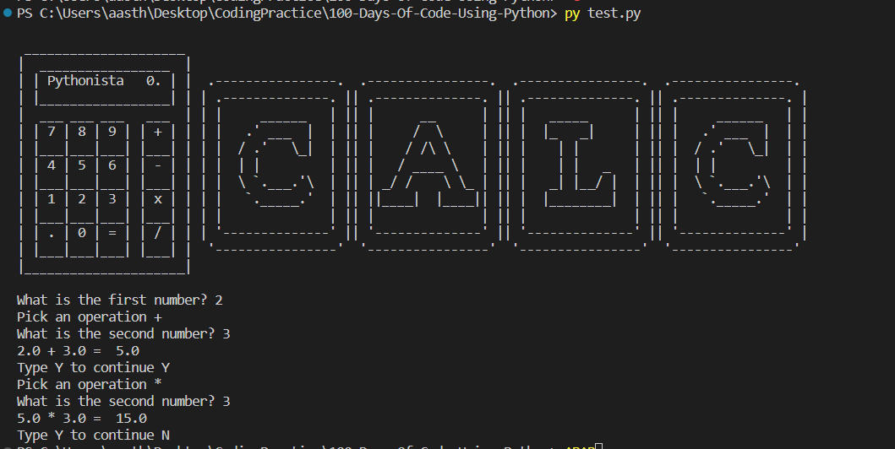
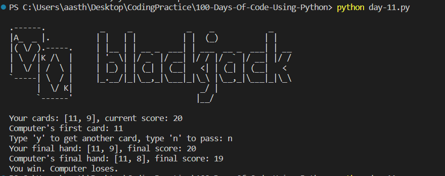

# 100 Days of Code Challenge

## Overview

This repository documents my progress in the 100 Days of Code challenge, following the Udemy course [100 Days of Code - The Complete Python Pro Bootcamp for 2021](https://www.udemy.com/course/100-days-of-code/).

## Table of Contents

1. [Day 1 - Working with Variables in Python to Manage Data](#day-1---working-with-variables-in-python-to-manage-data)
2. [Day 2 - Understanding Data Types and How to Manipulate Strings](#day-2--understanding-data-types-and-how-to-manipulate-strings)
3. [Day 3 - Control Flow and Logical Operators](#day-3--control-flow-and-logical-operators)
4. [Day 4 - Randomisation and Python Lists](#day-4---randomisation-and-python-lists)
5. [Day 5 - Beginner Python Loops](#day-5---beginner-python-loops)
6. [Day 6 - Mastering Python Functions & Navigating Complex Courses with Karel](#day-6---mastering-python-functions--navigating-complex-courses-with-karel)
7. [Day 7 - Hangman](#day-7---hangman)
8. [Day 8 - Function Parameters & Caesar Cipher](#day-8---function-parameters--caesar-cipher)
9. [Day 9 - Dictionaries, Nesting and the Secret Auction](#day-9---dictionaries-nesting-and-the-secret-auction)
10. [Day 10 - Functions with Outputs](#day-10---functions-with-outputs)
11. [Day 11 - The Blackjack Capstone Project](#day-11---the-blackjack-capstone-project)

## Day 1 - Working with Variables in Python to Manage Data

- **Printing Hello World:**
  - Introduced to the basic syntax of printing in Python.
  - Explored different approaches to printing multiline strings.
- **String Manipulation:**
  - Learned about string concatenation and escape characters.
  - Explored various ways to manipulate strings in Python.
- **Debugging Practice:**
  - Fixed errors in a code snippet related to string manipulation.
- **Input Function:**
  - Explored the use of the `input` function to take user input.
- **Length of a String:**
  - Wrote a program to calculate and output the number of characters in any name.
- **Swap Variables:**
  - Created a program to switch the values stored in two variables.
- **Band Name Generator:**
  - Developed a simple Band Name Generator using user input for city and pet names.

## Day 2 - Understanding Data Types and How to Manipulate Strings

- **Subscripting:**
  - Demonstrated the method of pulling out a particular element from a string.
- **Type Checking and Conversion:**
  - Explored type checking using the `type` function.
  - Demonstrated type conversion between string, int, and float.
- **Add digits in a number:**
  - Wrote a program to add the digits in a 2-digit number.
- **Mathematical Operations:**
  - Covered basic mathematical operations in Python.
  - Explained the order of operations (PE(MD)(AS)).
- **BMI Calculator:**
  - Created a program to calculate Body Mass Index (BMI) from user input.
- **Additional Mathematical Operations:**
  - Demonstrated rounding and floor division.
- **f-String:**
  - Introduced the use of f-strings for string formatting.
- **Life in Weeks:**
  - Calculated and displayed the number of weeks left based on the user's age.
- **Tip Calculator:**
  - Developed a program to calculate the bill per person, including a specified tip.

## Day 3 - Control Flow and Logical Operators

- **Rollercoaster Height Checker:**
  - Implemented a Python program that greets users entering a rollercoaster and checks whether they meet the height requirement.
- **Odd or Even Number:**
  - Created a program that determines if a given number is odd or even.
- **BMI 2.0:**
  - Developed a program that interprets the Body Mass Index (BMI) based on a user's weight and height.
- **Leap Year:**
  - Wrote a program that determines if a given year is a leap year.
- **Python Pizza Order:**
  - Implemented an automatic pizza order program based on user choices for pizza size, pepperoni, and extra cheese.
- **Love Calculator:**
  - Developed a program to test compatibility between two people based on the occurrence of specific letters in their names.
- **Text-based Adventure Game:**
  - Created a text-based adventure game where the player makes choices leading to different outcomes.

## Day 4 - Randomisation and Python Lists

- **Randomization:**
  - Introduced the use of the `random` module in Python.
  - Demonstrated generating random integers and floating-point values.
- **Coin Toss Program:**
  - Implemented a virtual coin toss program using random numbers.
- **Banker Roulette:**
  - Developed a program to randomly select a person from a list for paying a food bill.
- **Lists and Nested Lists:**
  - Explored the concept of lists in Python, including basic operations and nested lists.
- **Treasure Map:**
  - Created a program that marks a spot on a map with an "X" based on user input.
- **Rock, Paper, Scissors Game:**
  - Implemented a simple rock, paper, scissors game with ASCII art.

## Day 5 - Beginner Python Loops

- **For loop - do something to each item:**
  - Introduced the concept of a for loop in Python.
  - Illustrated how indentation is crucial in defining the scope of the for loop.

- **Average Height:**
  - Wrote a program that calculates the average student height from a list of heights without using `sum()` or `len()` functions.

- **High Score:**
  - Developed a program to find the highest score from a list of scores without using `max()` function.

- **Adding Even Numbers:**
  - Created a program to calculate the sum of all even numbers from 1 to X.

- **FizzBuzz Game:**
  - Implemented the FizzBuzz game rules, printing numbers from 1 to 100 with specific conditions for multiples of 3, 5, or both.

- **Password Generator: Easy Version:**
  - Developed a password generator that takes user inputs for the number of letters, symbols, and numbers, generating a password with a specific sequence.

- **Password Generator: Hard Version:**
  - Enhanced the password generator to randomize the order of letters, symbols, and numbers in the generated password.

## Day 6 - Beginner Python Functions & Karel

- **Introduction to Functions:**
  - Learned about defining functions in Python using the `def` keyword followed by the function name and core logic indented.
  - Understood the importance of indentation and the preferred method of using spaces over tabs according to the official Python documentation.

- **Hurdles Race 1:**
  - Solved a hurdles race challenge using Python functions `move()` and `turn_left()` to navigate Reeborg through a predefined path.
  - Recognized repeated patterns in the solution and defined a function named `jump()` to simplify the program.

- **Hurdles Race 2:**
  - Addressed a hurdles race challenge where the length of the race was not known in advance.
  - Implemented a solution using a `while` loop and the `at_goal()` function to navigate through the race course.

- **Hurdles Race 3:**
  - Tackled a hurdles race challenge with changing positions and numbers of hurdles.
  - Used a combination of `while` loop and `if` statement with functions like `front_is_clear()` and `at_goal()` to navigate Reeborg through the course.

- **Hurdles Race 4:**
  - Faced a hurdles race challenge with varying positions and heights of hurdles.
  - Developed a solution using functions like `wall_on_right()` and `wall_in_front()` along with loops and conditional statements to navigate Reeborg through the course.

- **Lost in a Maze:**
  - Encountered a maze exploration challenge where Reeborg's flashlight battery ran out.
  - Implemented an `if/elif/else` statement logic to guide Reeborg along the right edge of the maze towards the exit.

## Day 7 - Hangman Game

- **Hangman 1 :**
    - Write a program that selects a word from a list, prompts the user to guess a letter, and checks if the guessed letter is in the chosen word. Make sure to account for letter case.

- **Hangman 2:**
    - Given a randomly chosen word from a list, prompt the user to guess a letter. Then, reveal if the guessed letter is correct and update the display to show the guessed letter in its correct position within the word.

- **Hangman 3:**
    - Guess all the letters in a randomly chosen word. With each correct guess, reveal the letters in their correct positions. Use a while loop to keep guessing until you've uncovered all the letters and filled in all the blanks ('_').

- **Hangman 4:**
    - Guess the letters of a randomly chosen word. Each incorrect guess will take away one of your six lives. If you lose all your lives, the game ends. Can you guess all the letters before running out of lives?

- **Hangman 5:**
    - Implement the Hangman game in Python using a list of words. Players should be able to guess letters until they either win or lose. The program should provide appropriate feedback for correct and incorrect guesses, and it should also keep track of the remaining lives.

## Day 8 - Function Parameters & Caesar Cipher

- **Function Definition and Calling:**
  - Learned how to define functions with and without parameters using the `def` keyword.
  - Explored different ways of calling functions with and without arguments.

- **Parameter Passing:**
  - Understood the concept of function parameters as placeholders for data that can be passed during function invocation.
  - Explored the distinction between formal parameters (defined in the function signature) and actual arguments (passed during function call).

- **Function Modularity:**
  - Recognized the benefits of modularizing code using functions with parameters, enabling code reuse and enhancing readability.

- **Caesar Cipher Encryption and Decryption:**
  - Explored the implementation of the Caesar cipher encryption and decryption algorithms.
  - Learned how to shift characters in the alphabet to encode and decode messages.

- **User Interaction in Functions:**
  - Incorporated user input and interaction within functions to enhance the versatility and usability of the Caesar cipher program.

- **Looping Constructs for Game Control:**
  - Implemented looping constructs to enable repeated encryption/decryption tasks based on user input.
  - Used while loops to maintain program execution until the user decides to exit.

## Day 9 - Dictionaries, Nesting and the Secret Auction

- **Dictionary Basics:**
  - Introduced the concept of dictionaries in Python as key-value pairs.
  - Demonstrated adding items to a dictionary and looping through its keys.

- **Scoring Criteria Program:**
  - Implemented a program to convert exam scores to grades based on predefined criteria.
  - Created a new dictionary, `student_grades`, containing student names as keys and their corresponding grades as values.

- **Nested Dictionaries and Lists:**
  - Explored nested data structures, such as dictionaries containing lists.
  - Illustrated how to access and manipulate data within nested structures.

- **Adding Entries to a Travel Log:**
  - Developed a function to add new entries for countries visited to a travel log, without directly modifying the log.
  - Utilized function parameters to accept country name, number of visits, and a list of cities visited.

- **Secret Auction Program:**
  - Designed a Python program for a secret auction, prompting bidders for their name and bid amount.
  - Determined the winner based on the highest bid and printed their name along with the winning bid amount.

## Day 10 - Functions with Outputs

- **Leap Year and Days in Month:**
  - Modified `is_leap()` to return `True` for leap years, and developed `days_in_month()` to calculate days based on input year and month.

- **Simple Calculator Program:**
  - Created a basic calculator using functions for arithmetic operations. 
  - 

## Day 11 - The Blackjack Capstone Project

- **Blackjack Game Rules:**
  - Familiarize yourself with the rules of Blackjack, including the objective of having a hand value as close to 21 as possible without exceeding it.
  - Understand the values of different cards, including face cards and Aces, and how they contribute to the hand value.
  - Learn about the conditions for winning, losing, or drawing in a Blackjack game.

- **Python Implementation:**
  - Explore the Python code provided for implementing a simplified version of Blackjack.
  - Understand the functions for dealing cards, calculating the sum of a hand, and simulating a single game of Blackjack between a player and a dealer.
  - Recognize the logic for player decisions, such as whether to get another card or pass, and the dealer's actions based on their hand value.

- **Simulation and Outcome:**
  - Gain insights into how the Blackjack game simulation works, including dealing initial cards, player decisions, dealer actions, and determining the outcome of the game.
  - Understand the final hand comparison and the conditions for declaring the winner or a draw.
  - Explore the use of loops, conditional statements, and functions in the implementation of the Blackjack game in Python.

- 